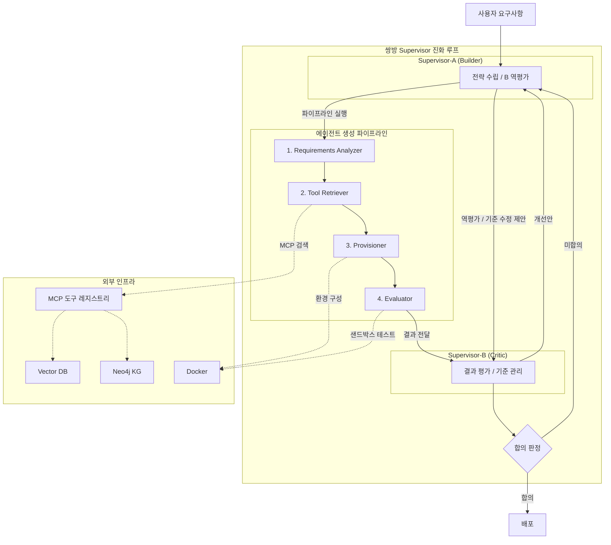
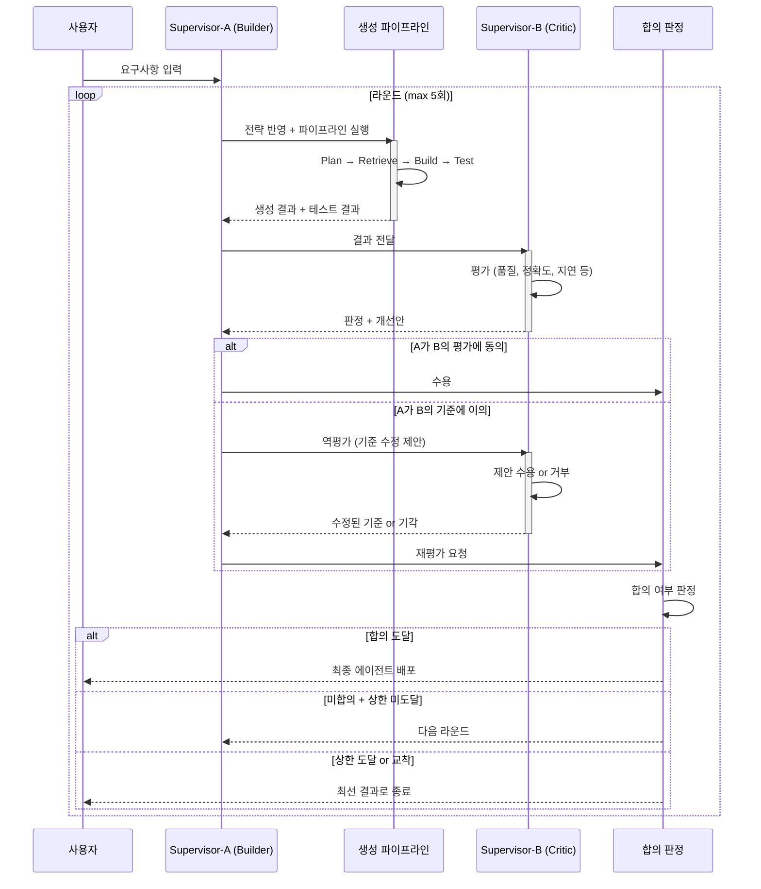
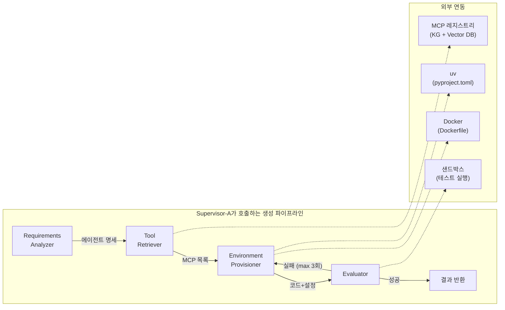

# Meta-Agent — 에이전트를 만드는 에이전트

> 사용자의 요구사항을 분석해 하위 에이전트(Child Agent)를 **동적으로 생성·검증·배포**하는 시스템  
> MCP 도구를 표준 연결 규격으로 활용

---

## 목차

0. [아키텍처 전체 그림](#아키텍처-전체-그림)
1. [핵심 개념 — 쌍방 진화](#1-핵심-개념--쌍방-진화)
2. [핵심 컴포넌트 (4개 노드)](#2-핵심-컴포넌트)
3. [파이프라인 흐름](#3-파이프라인-흐름)
4. [오케스트레이션 설계 — 쌍방 Supervisor](#4-오케스트레이션-설계--쌍방-supervisor)
5. [실패 정책](#5-실패-정책)
6. [기존 아키텍처와의 관계](#6-기존-아키텍처와의-관계)

---

## 아키텍처 전체 그림

### 시스템 전체 구조



### 쌍방 Supervisor 라운드 흐름



### 에이전트 생성 파이프라인 상세



---

## 1. 핵심 개념 — 쌍방 진화

### 1-1. 세 가지 축

| 축 | 역할 |
|---|---|
| **Meta-Agent** | 요구사항을 분석해 특정 작업을 수행할 노드(Child Agent)들을 동적으로 생성 |
| **MCP** | 각 노드(Agent)가 외부 인프라·데이터와 소통할 수 있도록 도구(Tool/Context)를 표준화된 규격으로 연결 |
| **오케스트레이션** | 생성된 노드와 도구들을 그래프 형태로 엮어 전체 실행 궤도를 통제 |

### 1-2. 핵심 원리 — "오케스트레이션을 평가하는 오케스트레이션"

이 시스템의 본질은 **두 Supervisor가 서로를 평가하고 개선하면서 함께 진화**하는 것이다.

한쪽이 만들면 다른 쪽이 평가하고, 평가 기준 자체도 상대가 고쳐줄 수 있다. 이 왕복이 반복되면서 산출물과 평가 기준이 **동시에 진화**한다.

```
Supervisor-A (Builder)          Supervisor-B (Critic)
  에이전트 생성 ──────────→
                               ←── 평가 + 개선안
  개선안 반영 + 재생성
  + "B의 기준이 너무 엄격" ──→
                               ←── 기준 수정 + 재평가
  ... 합의할 때까지 반복
```

이것이 단순 재시도(retry)와 다른 점:

| | 단순 재시도 | 쌍방 진화 |
|---|---|---|
| 뭘 바꾸나 | 같은 전략으로 다시 시도 | **전략 자체**를 바꿈 |
| 평가 기준 | 고정 | 평가 기준도 **수정 대상** |
| 방향 | 일방향 (만드는 놈 → 평가) | **쌍방향** (서로 평가·수정) |
| 결과 | 같은 품질 반복 | 라운드마다 **산출물 + 기준 동시 품질 상승** |

---

## 2. 핵심 컴포넌트

Meta-Agent를 구성하는 4개의 노드.

### 2-A. Requirements Analyzer (요구사항 분석기)

사용자의 목적을 분석하여 하위 에이전트의 **페르소나, 목표, 제약사항**을 정의한다.

- 입력: 자연어 요구사항
- 출력: 에이전트 명세 (시스템 프롬프트 초안, 필요 도구 목록, 제약 조건)

### 2-B. Tool & Context Retriever (도구 검색기)

하위 에이전트에게 필요한 **MCP 서버나 API를 탐색**한다.

- 사용 가능한 MCP 도구들의 명세(Schema)를 관리·검색하기 위해 **Knowledge Graph(Neo4j) + Vector DB**를 활용하는 RAG 파이프라인 구축
- 입력: 에이전트 명세의 필요 도구 목록
- 출력: 매칭된 MCP 서버 URI + 도구 스키마

### 2-C. Environment Provisioner (환경 프로비저닝)

생성된 하위 에이전트가 **독립적으로 실행될 수 있는 환경**을 구성한다.

| 요소 | 도구 | 역할 |
|------|------|------|
| 패키지 관리 | **uv** | `pyproject.toml` 기반 의존성 정의 (빠르고 가벼움) |
| 컨테이너화 | **Docker** | `Dockerfile` 자동 생성 → 실무 배포 용이 |

- 입력: 시스템 프롬프트 + MCP 서버 URI 목록
- 출력: 실행 가능한 프로젝트 (코드 + pyproject.toml + Dockerfile)

### 2-D. Evaluator (평가기)

생성된 에이전트가 주어진 도구를 제대로 호출하는지 **샌드박스 환경에서 테스트**한다.

- 더미 입력으로 도구 호출(Tool Call) 성공 여부 검증
- 실패 시 프롬프트나 MCP 구성을 수정 (**Self-Correction**)
- 3회 실패 시 오류 반환 후 중단 (→ [5. 실패 정책](#5-실패-정책))

---

## 3. 파이프라인 흐름

```
[Input]
  "최신 환율 정보를 바탕으로 무역 차익을 계산하는 에이전트를 만들어줘."

    ↓

[1. Plan] — Requirements Analyzer
  Meta-Agent가 시스템 프롬프트 초안 작성
  → 에이전트 페르소나·목표·제약사항 정의

    ↓

[2. Retrieve] — Tool & Context Retriever
  도구 저장소(KG / Vector DB)에서 필요 MCP 명세 검색
  → Exchange-Rate-MCP, Calculator-MCP 선택

    ↓

[3. Build] — Environment Provisioner
  시스템 프롬프트 + MCP 서버 URI 목록 + pyproject.toml 생성
  → 실행 가능한 에이전트 코드 패키징

    ↓

[4. Test] — Evaluator
  더미 입력으로 도구 호출 성공 여부 검증
  → 실패 시 Self-Correction (최대 3회)

    ↓

[5. Deploy]
  Docker 이미지로 빌드 및 실행
```

---

## 4. 오케스트레이션 설계 — 쌍방 Supervisor

### 4-1. 구조 — 서로를 평가하는 두 Supervisor

고정된 **Supervisor 2개**가 서로의 산출물과 전략을 평가·수정하며 합의에 도달한다.

```
┌──────────────────────────────────────────────────────────────┐
│                        진화 루프                              │
│                                                              │
│   ┌─────────────────────┐     ┌─────────────────────┐       │
│   │  Supervisor-A       │     │  Supervisor-B       │       │
│   │  (Builder)          │     │  (Critic)           │       │
│   │                     │     │                     │       │
│   │  - 에이전트 생성     │ ──→ │  - 결과 평가         │       │
│   │  - 전략 수립         │     │  - 개선안 제시       │       │
│   │  - B의 평가를 역평가 │ ←── │  - 평가 기준 관리    │       │
│   │  - B의 기준 수정 제안│     │  - A의 제안 수용/거부│       │
│   └─────────────────────┘     └─────────────────────┘       │
│            │                           │                     │
│            └───── 합의 도달 ────────────┘                     │
│                      ↓                                       │
│                   Deploy                                     │
└──────────────────────────────────────────────────────────────┘
```

| Supervisor | 역할 | 모델 전략 |
|------------|------|-----------|
| **A (Builder)** | 에이전트를 만들고, 전략을 세우고, B의 평가를 역평가한다 | **경량 모델** (빈번한 생성·수정 작업) |
| **B (Critic)** | A의 결과를 평가하고, 개선안을 제시하고, 평가 기준을 관리한다 | **경량 모델** (빈번한 평가 작업) |

### 4-2. 라운드 흐름 — 쌍방향 피드백 루프

하나의 라운드는 4단계로 구성된다.

```
[라운드 N]

  (1) A가 에이전트를 생성 (또는 이전 피드백 반영해 재생성)
       └── Plan → Retrieve → Build → Test

  (2) B가 결과를 평가
       └── 산출물 품질 + 도구 호출 정확도 + 응답 지연시간 등
       └── 판정: 통과 / 불통과 + 구체적 개선안

  (3) A가 B의 평가를 역평가 (선택적)
       └── "B의 기준이 비현실적이다" → 기준 수정 제안
       └── "B의 개선안이 타당하다" → 수용

  (4) B가 A의 역제안을 수용/거부
       └── 수용 → 평가 기준 수정 후 다음 라운드
       └── 거부 → 기존 기준 유지, A가 개선안대로 재생성

  → 합의 도달 시 종료, 미합의 시 라운드 N+1로
```

### 4-3. 쌍방 진화에서 바뀌는 것들

매 라운드에서 A와 B가 수정할 수 있는 대상:

| 수정 주체 | 수정 대상 | 예시 |
|-----------|-----------|------|
| **A** | 파이프라인 전략 | Retrieve부터 다시 / 요구사항 재분석 |
| **A** | 도구 구성 | MCP-A → MCP-A + MCP-B 조합 |
| **A** | 프롬프트 | 하위 에이전트 시스템 프롬프트 재작성 |
| **A** | B의 평가 기준 | "정확도 기준이 너무 높다" → 완화 제안 |
| **B** | 평가 기준 | "성공/실패" → "정확도 + 지연시간 + 비용" |
| **B** | 재시도 전략 | 3회 → 5회 / 백오프 추가 |
| **B** | 모델 전략 | "이 작업엔 더 큰 모델이 필요" |
| **B** | 접근 방식 | "단일 에이전트가 아니라 2개로 분리해야" |

### 4-4. 진화 시나리오

**시나리오 A — 도구 호출은 되지만 품질 부족**

| 라운드 | A (Builder) | B (Critic) |
|--------|-------------|------------|
| 1 | 에이전트 생성, Test 통과 | "도구 호출은 OK, 응답 정확도 낮음" + 개선안: 프롬프트 강화 |
| 2 | 프롬프트 강화해서 재생성 | "정확도 올랐는데 느림" + 평가 기준에 지연시간 추가 |
| 3 | 경량 MCP로 교체 + 재생성 | 통과 → 합의 → 배포 |

**시나리오 B — A가 B의 평가를 역평가**

| 라운드 | A (Builder) | B (Critic) |
|--------|-------------|------------|
| 1 | 에이전트 생성 | "응답 정확도 95% 미만 → 불통과" |
| 2 | "95%는 비현실적, 이 도메인에서 80%면 충분" → 기준 수정 제안 | 수용, 기준을 80%로 완화 |
| 3 | 이전 결과 재제출 | 80% 기준 통과 → 합의 → 배포 |

**시나리오 C — 전략 전면 전환**

| 라운드 | A (Builder) | B (Critic) |
|--------|-------------|------------|
| 1~3 | 단일 에이전트로 계속 시도, 실패 | "구조적으로 단일 에이전트론 불가능" + 제안: 문제를 2개로 분해 |
| 4 | 수용, 에이전트 2개로 재설계 | 통과 → 합의 → 배포 |

### 4-5. 합의 판정 기준

두 Supervisor가 **합의에 도달했다**고 판정하는 조건:

| 조건 | 설명 |
|------|------|
| **B가 통과 판정** | Critic이 현재 산출물을 승인 |
| **A가 B의 평가를 수용** | Builder가 역평가 없이 결과를 수용 |
| **양측 무변경** | 직전 라운드 대비 A도 B도 수정 사항 없음 (= 균형점 도달) |

---

## 5. 실패 정책

### 5-1. 파이프라인 내 실패 — 3회 규칙

> **같은 라운드의 파이프라인(Plan→Retrieve→Build→Test) 안에서 3번 실패하면 중단한다.**  
> 다음 단계로 넘어가지 않는다.

- 각 노드는 독립적으로 실패 카운터를 보유
- Supervisor-A가 단계별 실패 횟수를 추적
- 3회 초과 → 중단하고 실패 사유를 **Supervisor-B에 리포트**
- B가 전략 수정 → 다음 라운드에서 A가 수정된 전략으로 재시도

### 5-2. 라운드 상한 가드

쌍방 진화도 무한히 돌면 안 된다.

| 가드 | 기준 | 동작 |
|------|------|------|
| 라운드 상한 | `MAX_ROUNDS` (기본 5) | 상한 도달 시 현재까지 최선의 결과로 graceful 종료 |
| 합의 정체 | 2라운드 연속 양측 모두 변경 없음 (교착) | 현재 결과로 종료 |
| 비용 한도 | 누적 토큰/비용이 임계값 초과 | 강제 종료 + 경고 |

### 5-3. 기존 표준과의 정합

[`agent-development-standards-v2.md`](./agent-development-standards-v2.md) §4.4의 반복 루프 가드와 동일한 원칙:

- 카운터는 State에 두고 루프 노드에서 증가
- 한도 초과는 에러가 아니라 **현재까지의 결과로 graceful 종료**
- 파이프라인 내 `MAX_ITERATION = 3`, 라운드 간 `MAX_ROUNDS = 5`

---

## 6. 기존 아키텍처와의 관계

### 6-1. 프로젝트 구조 내 위치

[`project-structure.md`](./project-structure.md) 기준으로 Meta-Agent는 다음 위치에 배치된다.

```
app/
├── agents/
│   ├── meta_agent/
│   │   ├── nodes/
│   │   │   ├── requirements.py      # Requirements Analyzer 노드
│   │   │   ├── tool_retriever.py    # Tool & Context Retriever 노드
│   │   │   ├── provisioner.py       # Environment Provisioner 노드
│   │   │   └── evaluator.py         # Evaluator 노드
│   │   ├── graph.py                 # create_meta_agent_workflow()
│   │   ├── state.py                 # MetaAgentState (TypedDict)
│   │   └── prompts.py
│   │
│   ├── meta_supervisor/
│   │   ├── nodes/
│   │   │   ├── builder_supervisor.py    # Supervisor-A (Builder)
│   │   │   └── critic_supervisor.py     # Supervisor-B (Critic)
│   │   ├── graph.py                     # create_dual_supervisor_workflow()
│   │   ├── state.py                     # DualSupervisorState
│   │   └── prompts.py                   # A/B 각각의 시스템 프롬프트
│   │
│   ├── search_agent/
│   ├── writer_agent/
│   └── ...
│
├── services/
│   └── mcp/
│       ├── registry.py              # MCP 도구 명세 관리 (KG/Vector DB)
│       └── schema_store.py          # MCP 스키마 저장·검색
│
└── tools/
    └── mcp/
        ├── mcp_search.py            # @tool — MCP 도구 검색
        └── mcp_provision.py         # @tool — 환경 프로비저닝
```

### 6-2. LangGraph 그래프 구조

두 그래프가 필요하다: **에이전트 생성 파이프라인**과 **쌍방 Supervisor 루프**.

**에이전트 생성 파이프라인** (Supervisor-A가 호출):

```python
def create_meta_agent_workflow():
    workflow = StateGraph(MetaAgentState)

    workflow.add_node("requirements", run_requirements_analyzer)
    workflow.add_node("retrieve_tools", run_tool_retriever)
    workflow.add_node("provision", run_provisioner)
    workflow.add_node("evaluate", run_evaluator)

    workflow.set_entry_point("requirements")
    workflow.add_edge("requirements", "retrieve_tools")
    workflow.add_edge("retrieve_tools", "provision")
    workflow.add_edge("provision", "evaluate")
    workflow.add_conditional_edges("evaluate", route_after_eval, {
        "deploy": END,
        "retry": "provision",
    })
    return workflow.compile()
```

**쌍방 Supervisor 루프** (진화의 본체):

```python
def create_dual_supervisor_workflow():
    workflow = StateGraph(DualSupervisorState)

    # Supervisor-A: 에이전트 생성 파이프라인 실행
    workflow.add_node("builder", run_builder_supervisor)

    # Supervisor-B: 결과 평가 + 개선안 제시
    workflow.add_node("critic", run_critic_supervisor)

    # Supervisor-A: B의 평가를 역평가 (선택적)
    workflow.add_node("counter_review", run_counter_review)

    # 합의 판정
    workflow.add_node("consensus_check", run_consensus_check)

    workflow.set_entry_point("builder")
    workflow.add_edge("builder", "critic")
    workflow.add_edge("critic", "counter_review")
    workflow.add_conditional_edges("counter_review", route_after_counter, {
        "accept": "consensus_check",         # A가 B의 평가 수용
        "challenge": "critic",               # A가 B에게 기준 수정 제안 → B 재평가
    })
    workflow.add_conditional_edges("consensus_check", route_consensus, {
        "agreed": END,                       # 합의 → 배포
        "next_round": "builder",             # 미합의 → 다음 라운드
        "give_up": END,                      # 상한 도달 → graceful 종료
    })
    return workflow.compile()
```

### 6-3. State 설계 (초안)

```python
class MetaAgentState(TypedDict):
    """에이전트 생성 파이프라인 State — Supervisor-A가 호출"""
    job_id: str
    user_request: str

    # Requirements Analyzer
    agent_spec: dict

    # Tool Retriever
    mcp_tools: list[dict]

    # Provisioner
    system_prompt: str
    project_files: dict

    # Evaluator
    test_result: dict
    retry_count: int              # 파이프라인 내 실패 카운터 (MAX_ITERATION = 3)

    current_step: str
    error: Optional[str]


class DualSupervisorState(TypedDict):
    """쌍방 Supervisor 루프 State"""
    job_id: str
    user_request: str

    # 라운드 추적
    round: int                                    # 현재 라운드 (0부터)
    max_rounds: int                               # 상한 (기본 5)
    history: Annotated[list[dict], operator.add]   # 라운드별 이력 누적

    # Supervisor-A (Builder) 산출물
    current_result: Optional[dict]                 # 생성된 에이전트 + 테스트 결과
    builder_strategy: dict                         # A의 현재 전략 (모델, 도구, 프롬프트)
    counter_review: Optional[dict]                 # A → B 역평가 (기준 수정 제안 등)

    # Supervisor-B (Critic) 산출물
    evaluation: Optional[dict]                     # B의 평가 결과
    improvement_plan: Optional[dict]               # B의 개선안
    eval_criteria: dict                            # B의 평가 기준 (라운드마다 수정 가능)

    # 합의
    is_agreed: bool                                # 양측 합의 여부
    best_result: Optional[dict]                    # 전 라운드 중 최고 결과
    stale_count: int                               # 연속 무변경 카운트 (교착 감지)
```

### 6-4. 해결해야 할 설계 과제

| 과제 | 내용 | 상태 |
|------|------|------|
| MCP 도구 레지스트리 | 사용 가능한 MCP 도구 명세를 KG/Vector DB에 어떤 스키마로 저장할지 | 미정 |
| A/B 모델 선정 | 두 Supervisor에 각각 어떤 모델을 쓸지 (같은 모델? 역할별 다른 모델?) | 미정 |
| 평가 기준 표현 | `eval_criteria`를 어떤 포맷으로 표현할지 (JSON 스키마? 자연어?) | 미정 |
| 합의 판정 로직 | "양측 무변경 = 교착" vs "양측 무변경 = 만족" 구분 방법 | 미정 |
| 샌드박스 환경 | Evaluator가 사용할 테스트 샌드박스 (Docker-in-Docker vs 로컬 venv) | 미정 |
| 동적 그래프 생성 | 생성된 에이전트의 노드 구성을 런타임에 StateGraph로 조립하는 방법 | 미정 |
| 역평가 범위 | A가 B의 어디까지 건드릴 수 있는지 (기준만? 프롬프트도? B의 모델도?) | 미정 |

---

## 관련 문서

| 문서 | 관계 |
|------|------|
| [`agent-development-standards-v2.md`](./agent-development-standards-v2.md) | 코딩 표준 — 그래프/노드/프롬프트/예외 처리 규칙 |
| [`project-structure.md`](./project-structure.md) | 디렉터리 레이아웃 — Meta-Agent 배치 위치 |
| [`ResearchMind_기획서.md`](./ResearchMind_기획서.md) | 제품 기획 — Multi-Agent 아키텍처 배경 |
