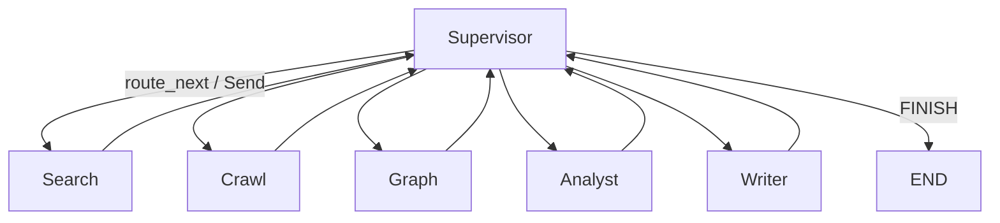
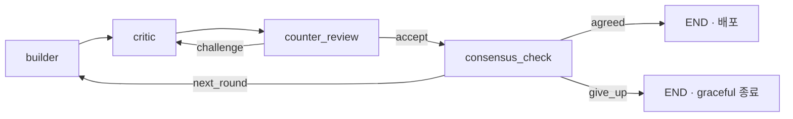

# Harness 엔지니어링 — 에이전트 실행 골격

> **하네스(Harness)** = LLM을 둘러싼 엔지니어링 스캐폴딩(제어 루프·상태·도구·오케스트레이션·실행 골격).
> 본 문서는 Synapse의 하네스를 **계층별로 한곳에 정리**한 개요입니다.
> 각 규칙의 상세 근거는 [`agent-development-standards-v2.md`](./agent-development-standards-v2.md)(베이스)와 [`agent.md`](./agent.md)(메타)를 따릅니다.

---

## 목차

0. [핵심 개념 — 하네스를 만드는 하네스](#0-핵심-개념--하네스를-만드는-하네스)
1. [그래프 — 하네스의 뼈대](#1-그래프--하네스의-뼈대)
2. [상태(State) — 노드 간 통신 규약](#2-상태state--노드-간-통신-규약)
3. [노드 계약(Node Contract)](#3-노드-계약node-contract)
4. [제어 루프 가드 — `MAX_ITERATION` vs `MAX_ROUNDS`](#4-제어-루프-가드--max_iteration-vs-max_rounds)
5. [LLM·프롬프트·도구 하네스](#5-llm프롬프트도구-하네스)
6. [오케스트레이션 하네스 — Supervisor ↔ Worker](#6-오케스트레이션-하네스--supervisor--worker)
7. [실행/통신 하네스 — 워커 골격](#7-실행통신-하네스--워커-골격)
8. [메타 하네스 — 하네스를 생성하는 하네스](#8-메타-하네스--하네스를-생성하는-하네스)
9. [정리 — 강제된 동형성](#9-정리--강제된-동형성)

---

## 0. 핵심 개념 — 하네스를 만드는 하네스

Synapse의 하네스는 두 계층으로 구성된다.

| 계층 | 정의 | 근거 문서 |
|------|------|-----------|
| **베이스 하네스** | 모든 에이전트가 공유하는 실행 골격 (그래프·상태·노드·루프·LLM·도구·실행) | `agent-development-standards-v2.md` |
| **메타 하네스** | 그 하네스를 **런타임에 생성**하는 Meta-Agent (쌍방 Supervisor 진화 루프) | `agent.md` |

> 핵심: **모든 에이전트가 같은 형태의 하네스를 강제로 따르게 만들고(베이스)**, 그 위에서 **하네스 자체를 동적으로 찍어내는 메타 하네스**를 올린 구조다.

---

## 1. 그래프 — 하네스의 뼈대

모든 에이전트는 동일한 그래프 골격으로 고정된다. (상세: 표준 문서 §4)

- 그래프는 `StateGraph` → `compile()`, **팩토리 함수** `create_<agent>_workflow()`로만 정의
- 진입점은 `set_entry_point()`로 명시, **모든 경로는 결국 `END`로 수렴** (고아 노드·무한 분기 금지)
- 분기는 인라인 람다가 아니라 **이름 있는 라우팅 함수**(`route_*`)로, **State 키 기반** 판단
- 사이클(평가→재작업 루프)에는 **반드시 종료 가드**(§4)

> 레거시 `meeting/graph.py`는 모듈 레벨 `app = workflow.compile()`이지만, **신규 그래프는 반드시 팩토리 함수**로 작성한다(테스트·재사용·서브그래프 합성 유리).

---

## 2. 상태(State) — 노드 간 통신 규약

- State는 **`TypedDict`** (Pydantic 아님)
- **`job_id` 필수** (로그·취소·추적)
- 노드는 **변경된 키만** 반환 (`return {"draft": draft}` · 전체 State 반환 금지)
- 병렬로 같은 키에 쓰면 `Annotated[list, operator.add]`로 누적 정의

---

## 3. 노드 계약(Node Contract)

하네스의 핵심은 **모든 노드가 동일한 시그니처를 강제받는 것**이다.

```python
async def run_planner(state: dict, config: RunnableConfig) -> dict:
    await check_if_canceled(state.get("job_id", ""))   # 장기 작업이면 취소 확인
    ...
    return {"task_list": tasks}                         # 변경 키만 반환
```

| 규칙 | 내용 |
|------|------|
| 시그니처 | 모든 노드는 **`async`** + `(state, config)` |
| 런타임 컨텍스트 | 인자가 아니라 **`config["configurable"]`** 에서 읽음 (ACL·컬렉션 등) |
| I/O | LLM·DB·도구 호출은 반드시 `await` |
| 부수효과 | 콜백 전송 등은 노드가 아니라 **워커/디스패처** 책임 (노드는 State만 변형) |
| 실패 | 노드 단위 실패는 **도메인 예외로 변환해 raise** |

---

## 4. 제어 루프 가드 — `MAX_ITERATION` vs `MAX_ROUNDS`

하네스 엔지니어링에서 가장 중요한 부분. 자기수정 루프에는 **반드시 종료 가드**를 둔다. 두 상수는 **루프의 층위가 다르다.**

| | `MAX_ITERATION = 3` | `MAX_ROUNDS = 5` |
|---|---|---|
| 적용 대상 | **안쪽 루프** — 하나의 에이전트 생성 파이프라인 내부 | **바깥 루프** — 쌍방 Supervisor 진화 라운드 |
| 무엇을 셈 | 같은 라운드 안의 `Plan→Retrieve→Build→Test`(또는 `evaluation→replan`) **자기수정 재시도 횟수** | Builder ↔ Critic이 **평가·개선을 주고받는 전체 왕복 횟수** |
| 카운터 위치 | `MetaAgentState.retry_count` (파이프라인 노드가 증가) | `DualSupervisorState.round` (진화 루프가 증가) |
| 초과 시 | 중단하고 실패 사유를 Supervisor-B에 리포트 | 현재까지 최선의 결과로 graceful 종료 |

### 중첩 루프 구조

```
[라운드 1]  ← MAX_ROUNDS 가 세는 단위 (최대 5)
   └─ Plan → Retrieve → Build → Test
                          ↑________│  ← MAX_ITERATION 가 세는 단위 (최대 3)
                          (Test 실패 시 Self-Correction, 3회까지)
   → Critic 평가 → (역평가) → 합의?  ── 미합의 ──┐
                                                  │
[라운드 2] ←──────────────────────────────────────┘
   └─ Plan → Retrieve → Build → Test ...
   ...
[라운드 5] 도달 → graceful 종료
```

- **`MAX_ITERATION`** = "이번 에이전트 한 번 만드는 시도에서, 도구 호출이 안 되면 몇 번까지 스스로 고쳐볼까?" → **3회**
- **`MAX_ROUNDS`** = "Builder와 Critic이 서로 평가·수정하며 몇 라운드까지 진화시킬까?" → **5라운드**

> 공통 원칙: **한도 초과는 에러가 아니라 graceful 종료**(현재까지 최선의 결과 반환). 카운터는 State에 두고 루프 노드에서 증가시킨다.

### 가드 라우팅 예시

```python
def route_after_eval(state) -> str:
    verdict = (state.get("evaluation_result") or {}).get("verdict", "not_enough")
    iteration = state.get("iteration", 0)
    if verdict == "good":
        return "output"          # → END
    if iteration >= MAX_ITERATION:
        return "output"          # 가드: 한도 초과 시 강제 종료
    return "replan"
```

추가 가드 (메타 루프, `agent.md` §5.2):

| 가드 | 기준 | 동작 |
|------|------|------|
| 라운드 상한 | `MAX_ROUNDS`(기본 5) | graceful 종료 |
| 합의 정체 | 2라운드 연속 양측 무변경(교착) | 현재 결과로 종료 |
| 비용 한도 | 누적 토큰/비용 임계값 초과 | 강제 종료 + 경고 |

---

## 5. LLM·프롬프트·도구 하네스

### 5.1 LLM 추상화 — 노드는 모델을 모른다

노드가 provider SDK를 직접 부르지 않고 **어댑터 한 겹**을 거치게 해서, 모델 교체가 설정 변경만으로 가능하다.

```
노드 ─get_llm_for_agent("xxx")─► LegacyLLMAdapter(LangChain BaseChatModel)
                                     │ _agenerate / _astream / bind_tools
                                     ▼
                              registry.create_streamer(provider, model)
                                     │ @register("openai"/"gemini"/"huggingface"...)
                                     ▼
                              provider별 Streamer (astream)
```

- 모델/프로바이더 교체 = `config.py`의 `<AGENT>_AGENT` 프로퍼티만 수정, **노드 코드 불변**
- LLM JSON 응답은 항상 `extract_json_from_llm_response()`로 파싱 (실패 시 `LLMOutputParsingError`)

### 5.2 프롬프트 계층

- 프롬프트는 코드에 인라인하지 않고 `ChatPromptTemplate`로 **`prompts.py`에 분리**
- `from_messages([...])`로 `("system", ...)` + `("human", ...)` 역할 분리
- JSON 출력 시 리터럴 중괄호는 `{{ }}`로 이스케이프

### 5.3 도구 계층

- 도구는 `app/tools/`에 `@tool` async 함수로 정의
- **docstring은 LLM이 읽는 영어 사용 설명서** ("무엇/언제 + Args/Returns")
- 내부 예외는 raise 대신 **에러 문자열 반환** (에이전트 루프 멈춤 방지)
- ACL 컨텍스트는 인자가 아니라 `config["configurable"]`에서 읽음

---

## 6. 오케스트레이션 하네스 — Supervisor ↔ Worker

여러 에이전트를 묶는 상위 하네스. (상세: 표준 문서 §9)



- Supervisor가 LLM으로 다음 워커(`next`)와 지시를 JSON으로 결정
- `next`는 **항상 리스트로 정규화**, 병렬 안전 워커는 **`Send`로 fan-out**
- 워커는 끝나면 **반드시 Supervisor로 복귀**, 종료는 **`FINISH` 신호로 일원화**
- 에이전트는 **서브그래프로 합성**되며, 부모↔자식 State 변환은 워커 노드 책임
- 위험 작업은 `interrupt_before` + `checkpointer`로 Human-in-the-loop

---

## 7. 실행/통신 하네스 — 워커 골격

그래프를 실제로 구동하는 진입점은 동일한 골격으로 감싼다. (상세: 표준 문서 §14, §19)

```python
@handle_ai_error(retry_count=1, retry_on=(LLMRateLimitError, LLMProviderError))
async def run_meeting_workflow(job_id, context, ...):
    ctx = JobContext(...)        # 추적 메타 묶음
    timer = JobTimer()           # 시간 측정
    try:
        ... await graph.ainvoke(...)
        await send_final_callback(...)       # 결과는 HTTP 콜백
    except JobCancelledError: raise          # 취소 = 정상 중단
    except AICoreError as e: ... raise       # 도메인 에러 전파
    except Exception as e: ...               # AIJOB-003
```

| 요소 | 도구 |
|------|------|
| 추적 메타 | `JobContext` → `ctx.callback_kwargs()` |
| 시간 측정 | `JobTimer` → `timer.elapsed()` |
| 재시도 | `@handle_ai_error(retry_on=(...))` |
| 예외 처리 | **취소 / 도메인 에러 / 기타** 3분기 |
| 결과 전달 | 동기 응답 아님 → **HTTP 콜백** (AI Core는 stateless) |
| 응답 포맷 | 표준 status/error(`<도메인>-<번호>` 코드 체계) |

---

## 8. 메타 하네스 — 하네스를 생성하는 하네스

Synapse의 차별점. 위 베이스 하네스 규칙을 **그대로 따르면서**, 런타임에 새 에이전트(=새 하네스)를 만들어내는 계층을 얹었다. (상세: [`agent.md`](./agent.md))

### 8.1 에이전트 생성 파이프라인 (4노드)

```
Requirements Analyzer → Tool Retriever → Environment Provisioner → Evaluator
   요구사항→명세           MCP 검색            uv/Docker 패키징         샌드박스 검증
   (KG+Vector RAG)                                            (실패 시 3회 Self-Correction)
```

- 이 파이프라인 자체가 `create_meta_agent_workflow()`라는 **표준 그래프**로 작성됨 (베이스 하네스 재사용)
- `MetaAgentState.retry_count`에 `MAX_ITERATION = 3` 가드 적용

### 8.2 쌍방 Supervisor 진화 루프

베이스 하네스의 단일 Supervisor를 **두 개(Builder/Critic)로 확장**한 것이 메타 하네스의 본체다.

| Supervisor | 역할 |
|------------|------|
| **A (Builder)** | 에이전트 생성·전략 수립·B의 평가를 역평가(기준 수정 제안) |
| **B (Critic)** | A의 결과 평가·개선안 제시·평가 기준 관리 |



여기서도 하네스 원칙이 그대로 적용된다.
- `route_after_counter` / `route_consensus` 같은 **이름 있는 라우팅 함수**로 분기
- `agreed` / `give_up` 둘 다 `END`로 수렴 → 무한 루프 차단
- 교착(`stale_count`)·비용 한도까지 가드로 관리

---

## 9. 정리 — 강제된 동형성

이 프로젝트의 하네스 엔지니어링 = **강제된 동형성(isomorphism)**. 모든 에이전트가 같은 형태를 따르게 만든다.

| 계층 | 무엇을 고정했나 | 무엇을 막나 |
|------|-----------------|-------------|
| 그래프 | `StateGraph`+팩토리, `END` 수렴 | 고아 노드·무한 분기 |
| 노드 | `async (state, config)`, 변경 키만 반환 | 부수효과 누수·State 오염 |
| 루프 | `MAX_ITERATION=3` / `MAX_ROUNDS=5` | 자기수정 폭주 |
| LLM | `get_llm_for_agent()` 어댑터 | provider 락인 |
| 도구 | `@tool` + 에러 문자열 반환 | 에이전트 루프 중단 |
| 실행 | `JobContext`/`@handle_ai_error`/콜백 | 추적 단절·예외 누수 |
| 메타 | 쌍방 Supervisor + 4노드 파이프라인 | 단일 재시도의 한계 |

---

## 관련 문서

| 문서 | 관계 |
|------|------|
| [`agent-development-standards-v2.md`](./agent-development-standards-v2.md) | 베이스 하네스 — 그래프/노드/프롬프트/도구/예외 코딩 표준 |
| [`agent.md`](./agent.md) | 메타 하네스 — Meta-Agent·쌍방 Supervisor 진화 루프 |
| [`project-structure.md`](./project-structure.md) | 디렉터리 레이아웃 — 각 계층의 배치 위치 |
