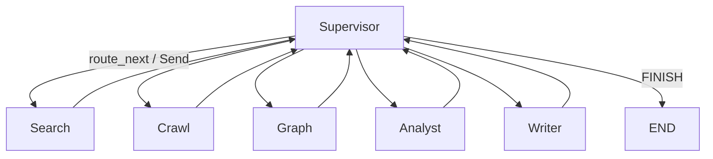

# Synapse 프로젝트 구조

> **목적**: 기획(화면·그래프 아키텍처) 확정 전까지 **디렉터리/레이어 골격**만 정의합니다.  
> 각 파일은 역할 설명 + `TODO` 주석 수준이며, 실제 LangGraph/React 구현은 기획 후 채웁니다.  
> 코딩 규칙의 상세는 [`agent-development-standards-v2.md`](./agent-development-standards-v2.md) 를 따릅니다.

---

## 1. 레포지토리 최상위

```
Synapse/
├── backend/                 # FastAPI + LangGraph AI Core
├── frontend/                # React (Vite + TypeScript) — UI 기획 전 스캐폴드
├── docs/                    # 기획·표준·구조 문서
├── .env.example             # 환경변수 템플릿
├── docker-compose.yml       # (선택) 로컬 Neo4j 등
└── README.md
```

---

## 2. 백엔드 레이어 개요

| 레이어 | 경로 | 책임 |
|--------|------|------|
| API | `app/api/` | FastAPI 라우터, Job 접수, 문서/검색 REST |
| 워크플로우 | `app/workflows/` | **Supervisor** 도메인 그래프 (에이전트 조율) |
| 에이전트 | `app/agents/` | **재사용 워커** — 에이전트별 독립 폴더·아키텍처 |
| 서비스 | `app/services/` | RAG, Worker, Job, Callback |
| 전처리 | `app/preprocessing/` | Adaptive Chunking 파이프라인 (기존 구현) |
| Vector DB | `app/vectordb/` | Milvus 클라이언트 (기존 구현) |
| 도구 | `app/tools/` | LangChain `@tool` — 에이전트가 호출하는 외부 I/O |
| 코어 | `app/core/` | 설정, LLM, 로깅, Enum, 예외 |
| 스키마 | `app/schemas/` | API/Job 응답 Pydantic 모델 |
| 공통 | `app/common.py` | logger, settings 등 재노출 |

### 데이터·실행 흐름 (개념)

```
[React] ──HTTP──► [app/api] ──► [services/workers] ──► [workflows/*] ──► [agents/*]
                                                      │
                                                      └──► [tools] ──► [services/rag] ──► Vector/Graph DB
```

---

## 3. 에이전트 폴더 (`app/agents/`)

**원칙**: 에이전트마다 **폴더를 분리**한다. 아키텍처(노드 구성·루프 유무)가 다를 수 있기 때문이다.

### 3.1 공통 파일 구성 (표준)

```
app/agents/<agent_name>/
├── nodes/           # 노드 함수 (여러 개면 폴더)
│   └── __init__.py
├── graph.py         # create_<agent>_workflow() — 그래프 정의 + compile
├── state.py         # <Agent>State (TypedDict)
├── prompts.py       # ChatPromptTemplate 모음
└── __init__.py
```

### 3.2 현재 에이전트 목록 (가칭)

| 폴더 | 역할 (기획 확정 전 가칭) | 예상 아키텍처 패턴 |
|------|-------------------------|-------------------|
| `search_agent/` | 벡터/하이브리드 검색 | search → filter → organize → evaluate (루프) |
| `crawl_agent/` | 웹·외부 소스 수집 | fetch → extract → normalize (선형) |
| `graph_agent/` | Neo4j 관계 탐색 | expand → summarize (선형) |
| `analyst_agent/` | 수집 자료 종합 분석 | analyze → critique (루프) |
| `writer_agent/` | 최종 리포트 작성 | planner → drafting → evaluation (루프) |
| `common/` | 도메인 공통 State·노드 | iteration 가드 등 |

> **규칙**: 노드/유틸은 `common/` 에 공유 가능. **그래프·State·프롬프트는 에이전트별 분리**.

---

## 4. Supervisor 워크플로우 (`app/workflows/`)

Supervisor(오케스트레이터)는 **에이전트 폴더와 분리**해 `workflows/` 에 둔다.

```
app/workflows/
└── research/                    # 리서치 도메인 (가칭 — 기획 후 이름 변경 가능)
    ├── nodes/
    │   ├── supervisor.py        # supervisor_node, route_next
    │   └── workers.py           # 각 agents/* 를 서브그래프로 호출하는 워커 노드
    ├── graph.py                 # create_research_workflow()
    ├── state.py                 # ResearchState (Supervisor + 워커 산출 필드)
    ├── prompts.py               # SUPERVISOR_SYSTEM_PROMPT
    └── __init__.py
```

### Supervisor ↔ Worker 관계 (개념)



- 워커 노드는 `app/agents/<name>/graph.py` 의 `create_*_workflow()` 를 **서브그래프**로 호출
- 부모↔자식 **State 변환**은 `workflows/.../nodes/workers.py` 책임
- 종료 신호는 Supervisor 의 `FINISH` 로만 (§9)

---

## 5. 서비스·도구·API

### 5.1 `app/services/`

```
services/
├── rag/
│   ├── vector_store.py      # VectorStore → Milvus
│   ├── graph_store.py       # GraphStore → Neo4j
│   ├── retriever.py         # hybrid_retrieve
│   └── reranker.py
├── jobs/
│   ├── job_store.py         # Job 상태·취소 (check_if_canceled)
│   └── job_context.py       # JobContext, JobTimer
├── workers/
│   └── research_worker.py   # run_research_workflow() — 그래프 ainvoke 진입점
└── callbacks.py             # send_final_callback / send_error_callback
```

### 5.2 `app/tools/`

```
tools/
└── rag/
    ├── vector_tools.py      # @tool search_vector_db
    └── graph_tools.py       # @tool search_graph_db
```

### 5.3 `app/api/`

```
api/
├── dependencies.py          # JWT/헤더 검증 (스텁)
├── agents.py                # POST /v1/agent/execute/* — Job 접수
├── jobs.py                  # Job 상태·취소
├── documents.py             # 문서 업로드·HITL (기존)
└── search.py                # RAG 검색 (기존)
```

---

## 6. 코어 (`app/core/`)

```
core/
├── config.py                # Settings + <AGENT>_AGENT LLM 설정
├── logging.py
├── enums.py                 # JobStatus, AIStepStatus, DocType ...
├── errors/
│   ├── exceptions.py
│   └── error_handler.py     # @handle_ai_error
└── llm/
    ├── adapter.py           # get_llm_for_agent()
    ├── registry.py          # provider 등록
    └── utils.py             # extract_json_from_llm_response()
```

`app/config.py` 는 하위 호환용 재노출(`from app.core.config import settings`).

---

## 7. 프론트엔드 (`frontend/` — React)

UI·화면 기획 전 **폴더 골격만** 유지한다.

```
frontend/
├── index.html
├── package.json
├── vite.config.ts           # dev 시 /api, /v1 → :8000 프록시
├── tsconfig.json
└── src/
    ├── main.tsx
    ├── App.tsx              # 라우팅 셸
    ├── index.css
    ├── api/                 # 백엔드 HTTP 클라이언트
    ├── components/          # 공통 UI 컴포넌트
    ├── pages/               # 화면별 페이지 (기획 후 구현)
    ├── hooks/               # (예정) React hooks
    ├── types/               # TS 타입
    └── lib/                 # 유틸
```

### 예상 화면 (기획 전 placeholder)

| 경로 | 페이지 | 비고 |
|------|--------|------|
| `/upload` | 문서 업로드 | 전처리 파이프라인 연동 |
| `/viewer` | HITL 청크 뷰어 | 색 농도·편집 |
| `/search` | RAG 검색 | |
| `/research` | 리서치 에이전트 실행 | Job 접수 + 상태 |

---

## 8. 환경변수 (`.env.example`)

주요 항목만 나열. 전체는 루트 `.env.example` 참고.

| 변수 | 용도 |
|------|------|
| `ANTHROPIC_API_KEY` | LLM |
| `LLM_PROVIDER` | anthropic / openai / gemini |
| `MILVUS_URI` | Vector DB |
| `NEO4J_*` | Graph DB |
| `CALLBACK_URL` | Job 결과 HTTP 콜백 |
| `VITE_API_BASE` | (frontend) API 베이스 URL |

---

## 9. 기획 확정 후 작업 순서 (체크리스트)

1. **워크플로우**: `workflows/research/state.py` 필드 · Supervisor 프롬프트 · 워커 목록 확정
2. **에이전트별**: 각 `agents/*/` 의 nodes / graph / prompts 구현
3. **Worker**: `services/workers/research_worker.py` 콜백·에러 분기 연동
4. **API**: `api/agents.py` Job 타입·스키마 확정
5. **프론트**: `pages/*` UI/UX 기획 반영
6. **Graph DB**: `graph_store.py` + Cypher 스키마

---

## 10. 관련 문서

| 문서 | 내용 |
|------|------|
| `agent-development-standards-v2.md` | LangGraph·에이전트 코딩 표준 |
| `ResearchMind_기획서.md` | (구) 제품 기획 — Synapse 로 리브랜딩 예정 |
| `Adaptive_Chunking_논문정리.md` | 전처리/청킹 배경 |

---

*문서 버전: 1.0 · 프로젝트명: **synapse***
