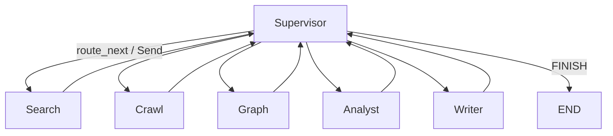

# Synapse 프로젝트 구조

> **현재 상태**: 아래 구조는 **실제 구현된 코드 기준**입니다 (2026-07 기준).
> 최신 실행·환경·모듈별 구현 현황은 [`구현_현황.md`](./구현_현황.md)를 함께 참고하세요.
> 코딩 규칙의 상세는 [`agent-development-standards-v2.md`](./agent-development-standards-v2.md)를 따릅니다.

---

## 1. 레포지토리 최상위

```
Synapse/
├── backend/                 # FastAPI + LangGraph AI Core
├── frontend/                # React (Vite + TypeScript)
├── docs/                    # 기획·표준·구조·현황 문서
├── docker-compose.yml       # (선택) 로컬 Neo4j 등
└── README.md
```

> `backend/.env`에 환경변수를 직접 작성합니다 (`.env.example` 템플릿은 현재 없음 — README §2 참고).

---

## 2. 백엔드 레이어 개요

| 레이어 | 경로 | 책임 |
|--------|------|------|
| API | `app/api/` | FastAPI 라우터 (meta_agent · tools · schedules · workflows · documents · search · agents · jobs) |
| Meta-Agent | `app/agents/meta_agent/` | 요구사항→도구 검색→코드 생성→평가 (4노드 파이프라인) |
| Meta-Supervisor | `app/agents/meta_supervisor/` | Builder↔Critic 쌍방 진화 루프 (Solo/Dual) |
| 리서치 워커 | `app/agents/{search,crawl,graph,analyst,writer}_agent/` | 리서치 도메인 재사용 에이전트 |
| 워크플로 | `app/workflows/research/` | Supervisor가 5개 워커를 조율하는 오케스트레이션 그래프 |
| 서비스 | `app/services/` | MCP 도구 런타임/레지스트리/청소부, 스케줄러, 에이전트 레지스트리, RAG, Job |
| 전처리 | `app/preprocessing/` | Adaptive Chunking 파이프라인 |
| Vector DB | `app/vectordb/` | Milvus 클라이언트 |
| 코어 | `app/core/` | 설정, LLM 어댑터, 로깅, Enum, 예외 |
| 스키마 | `app/schemas/` | API/Job 응답 Pydantic 모델 |
| 공통 | `app/common.py` | logger, settings 등 재노출 |

### 데이터·실행 흐름 (개념)

```
[React] ──HTTP──► [app/api] ──► [services/*] ──► [agents/meta_agent, meta_supervisor] ──► generated_tools/*.py
                        │
                        └──► [workflows/research] ──► [agents/{search,crawl,graph,analyst,writer}_agent]
                        │
                        └──► [services/rag] ──► Milvus / Neo4j
```

---

## 3. Meta-Agent — 에이전트 생성 파이프라인 (`app/agents/meta_agent/`)

```
app/agents/meta_agent/
├── nodes/
│   ├── requirements.py     # 요구사항 → 에이전트 명세
│   ├── planner.py          # 실행 계획 수립
│   ├── tool_retriever.py   # MCP 도구 레지스트리 검색
│   ├── provisioner.py      # 실행 가능한 Python 도구 코드 생성 (+ 결정적 보정)
│   └── evaluator.py        # 생성 규칙 위반 판정
├── graph.py                 # create_meta_agent_workflow()
├── state.py                 # MetaAgentState (retry_count 등)
├── prompts.py
└── harness.py                # LLM JSON 파싱 실패 재시도/복구 (생성 단계 하네스)
```

## 4. Meta-Supervisor — 쌍방 진화 루프 (`app/agents/meta_supervisor/`)

```
app/agents/meta_supervisor/
├── nodes/
│   ├── builder_supervisor.py   # Builder — 생성 + dry-run 실행
│   ├── counter_review.py       # Builder → Critic 역평가
│   └── consensus.py            # 합의 판정
├── graph.py                     # create_meta_supervisor_workflow() — Solo/Dual 분기
├── state.py                     # DualSupervisorState
└── prompts.py
```

- **Solo**: 1회 생성, 검증 없이 즉시 등록
- **Dual (Critic 모드)**: Builder가 dry-run 실행 → Critic 평가 → 미합의 시 재생성 (`max_rounds=2`)

## 5. 리서치 에이전트 폴더 (`app/agents/`)

**원칙**: 에이전트마다 **폴더를 분리**한다.

### 5.1 공통 파일 구성 (표준)

```
app/agents/<agent_name>/
├── nodes/           # 노드 함수 (여러 개면 폴더)
│   └── __init__.py
├── graph.py         # create_<agent>_workflow() — 그래프 정의 + compile
├── state.py         # <Agent>State (TypedDict)
├── prompts.py       # ChatPromptTemplate 모음
└── __init__.py
```

### 5.2 현재 에이전트 목록

| 폴더 | 역할 | 아키텍처 패턴 |
|------|------|-------------|
| `search_agent/` | 벡터/하이브리드 검색 | search → filter → organize → evaluate |
| `crawl_agent/` | 웹·외부 소스 수집 | fetch → extract → normalize |
| `graph_agent/` | Neo4j 관계 탐색 | expand → retrieve → summarize (GraphStore 검색 미구현 → LLM 대체) |
| `analyst_agent/` | 수집 자료 종합 분석 | analyze → critique → refine (루프) |
| `writer_agent/` | 최종 리포트 작성 | planner → drafting → evaluation (루프) |
| `common/` | 도메인 공통 State·노드 | iteration 가드 등 |

> **규칙**: 노드/유틸은 `common/`에 공유 가능. **그래프·State·프롬프트는 에이전트별 분리**.

---

## 6. Supervisor 워크플로우 (`app/workflows/research/`)

```
app/workflows/research/
├── nodes/
│   ├── supervisor.py        # supervisor_node, route_next
│   └── workers.py           # 각 agents/* 를 서브그래프로 호출하는 워커 노드
├── prompts.py                # SUPERVISOR_SYSTEM_PROMPT
└── __init__.py
```

### Supervisor ↔ Worker 관계 (개념)



- 워커 노드는 `app/agents/<name>/graph.py`의 `create_*_workflow()`를 **서브그래프**로 호출
- 부모↔자식 **State 변환**은 `workflows/research/nodes/workers.py` 책임
- 종료 신호는 Supervisor의 `FINISH`로만

---

## 7. 서비스·도구·API

### 7.1 `app/services/`

```
services/
├── mcp/
│   ├── registry.py            # MCP 도구 검색 (Milvus 기반)
│   ├── schema_store.py        # MCP 도구 명세 저장/조회
│   ├── tool_runtime.py        # subprocess 기반 도구 실행, env 주입, 공용 도구 보존
│   ├── tool_janitor.py        # 삭제 시 공용/필수/공유 도구 보호 판정 (LLM 심판)
│   ├── rag_tool.py
│   └── shared_tools_src/      # 공용 파서 등 영구 보존 도구 소스
├── agent_registry/
│   └── matcher.py              # Milvus 기반 CRUD + 유사도 매칭
├── agent_runner.py             # 도구 파이프라인 실행 + 런타임 하네스(전이적 실패 재시도)
├── prereq_checker.py           # SMTP/LLM/임베딩/스크래핑 + required_env 점검
├── scheduler/
│   └── engine.py                # APScheduler(Asia/Seoul), cron 등록/해제/즉시실행/로그
├── graph_serializer.py          # LangGraph → React Flow JSON
├── rag/
│   ├── vector_store.py          # VectorStore → Milvus
│   ├── graph_store.py           # GraphStore → Neo4j
│   ├── retriever.py, reranker.py, query_rewriter.py, bm25_store.py
├── jobs/
│   ├── job_store.py              # Job 상태
│   └── job_context.py            # JobContext, JobTimer
├── workers/
│   └── research_worker.py        # run_research_workflow() — 그래프 ainvoke 진입점
└── callbacks.py                  # send_final_callback / send_error_callback
```

### 7.2 `app/api/`

```
api/
├── dependencies.py          # JWT/헤더 검증 (스텁)
├── meta_agent.py            # 에이전트 생성/조회/실행/삭제 (POST /api/meta-agent/*)
├── tools.py                 # 생성된 도구 목록/코드 조회/단건 실행
├── schedules.py              # 스케줄 등록/해제/로그/즉시실행
├── workflows.py               # 내장/생성 에이전트 그래프 조회 (React Flow용)
├── agents.py                  # POST /v1/agent/execute/* — 리서치 Job 접수
├── jobs.py                    # Job 상태·취소
├── documents.py               # 문서 업로드·HITL
└── search.py                  # RAG 검색
```

---

## 8. 코어 (`app/core/`)

```
core/
├── config.py                # Settings + <AGENT>_AGENT LLM 설정
├── logging.py
├── enums.py                 # JobStatus, AIStepStatus, DocType ...
├── errors/
│   ├── exceptions.py
│   └── error_handler.py     # @handle_ai_error
└── llm/
    ├── adapter.py            # get_llm_for_agent()
    ├── registry.py           # provider 등록
    └── utils.py              # extract_json_from_llm_response()
```

`app/config.py`는 하위 호환용 재노출(`from app.core.config import settings`).

---

## 9. 프론트엔드 (`frontend/` — React, 구현 완료)

```
frontend/
├── index.html
├── package.json
├── vite.config.ts           # dev 시 /api, /v1 → :2004 프록시, 자동 브라우저 오픈
├── tsconfig.json
└── src/
    ├── main.tsx
    ├── App.tsx               # 라우팅 셸
    ├── index.css
    ├── api/client.ts         # 백엔드 HTTP 클라이언트
    ├── components/
    │   ├── Sidebar.tsx
    │   └── flow/              # React Flow 기반 그래프 시각화 (Dynamic/Supervisor/DocGraph/Pipeline/Research/Orchestrator/Neovis)
    ├── pages/
    │   ├── UploadPage.tsx, ViewerPage.tsx, SearchPage.tsx
    │   ├── AgentDashboardPage.tsx, AgentCreatePage.tsx, AgentFlowPage.tsx
    │   ├── ToolsPage.tsx, SchedulesPage.tsx, PlaceholderPage.tsx
    ├── types/                 # TS 타입
    └── lib/colors.ts
```

### 실제 화면 (라우팅)

| 경로 | 페이지 | 상태 |
|------|--------|------|
| `/upload` | 문서 업로드 | 동작 |
| `/viewer` | HITL 청크 뷰어 | 동작 |
| `/search` | RAG 검색 | 동작 |
| `/agents` | 에이전트 관리(대시보드) | 동작 |
| `/agents/create` | 에이전트 생성 (Solo/Dual) | 동작 |
| `/agents/flow` | 생성 에이전트 흐름도 (React Flow) | 동작 |
| `/tools` | MCP 도구 목록/코드 조회 | 동작 |
| `/schedules` | 스케줄(cron) 등록/로그 | 동작 |
| `/research` | 리서치 에이전트 Job 실행 | placeholder (UI 예정) |

---

## 10. 환경변수 (`backend/.env`)

주요 항목만 나열. 전체는 [`구현_현황.md`](./구현_현황.md) §2 참고.

| 변수 | 용도 |
|------|------|
| `ANTHROPIC_API_KEY`, `LLM_MODEL` | LLM |
| `MILVUS_URI`, `MILVUS_COLLECTION` | Vector DB |
| `EMBED_API_URL`, `RERANK_API_URL` | 임베딩/리랭크 외부 API |
| `NEO4J_*` | Graph DB (선택) |
| `SMTP_*` | 에이전트 메일 발송 (선택) |

---

## 11. 관련 문서

| 문서 | 내용 |
|------|------|
| [`구현_현황.md`](./구현_현황.md) | **최신** 실행 환경·모듈별 구현 상태·API 목록 |
| [`시작_가이드.md`](./시작_가이드.md) | 처음 쓰는 사람을 위한 단계별 가이드 |
| [`agent.md`](./agent.md) | Meta-Agent 설계 원안 (일부는 실제 구현과 다름 — `구현_현황.md` 우선) |
| [`agent-development-standards-v2.md`](./agent-development-standards-v2.md) | LangGraph·에이전트 코딩 표준 |
| [`ResearchMind_기획서.md`](./ResearchMind_기획서.md) | (구) 제품 기획 — Synapse로 리브랜딩 전 |
| [`Adaptive_Chunking_논문정리.md`](./Adaptive_Chunking_논문정리.md) | 전처리/청킹 배경 논문 |

---

*문서 버전: 2.0 · 프로젝트명: **synapse***
